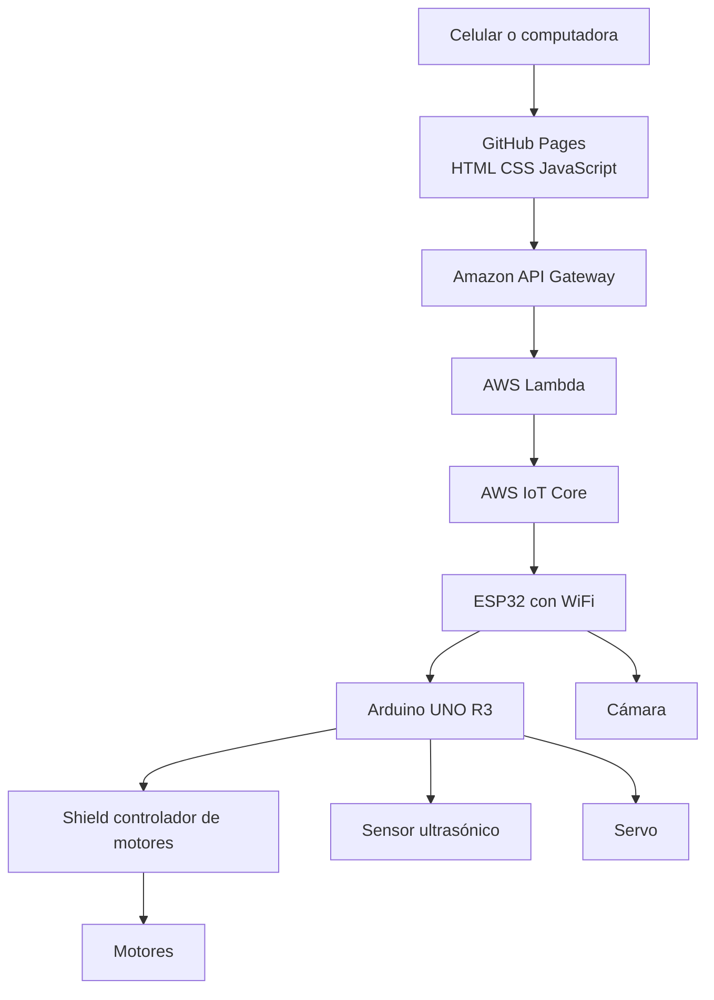
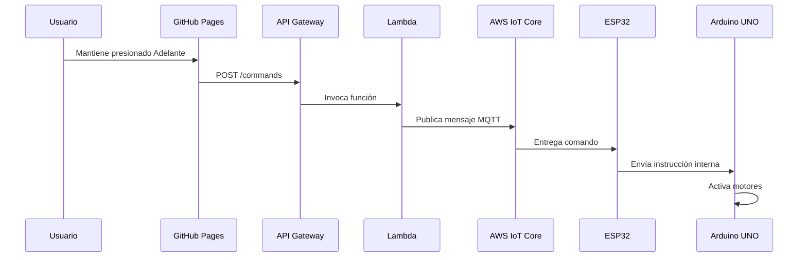
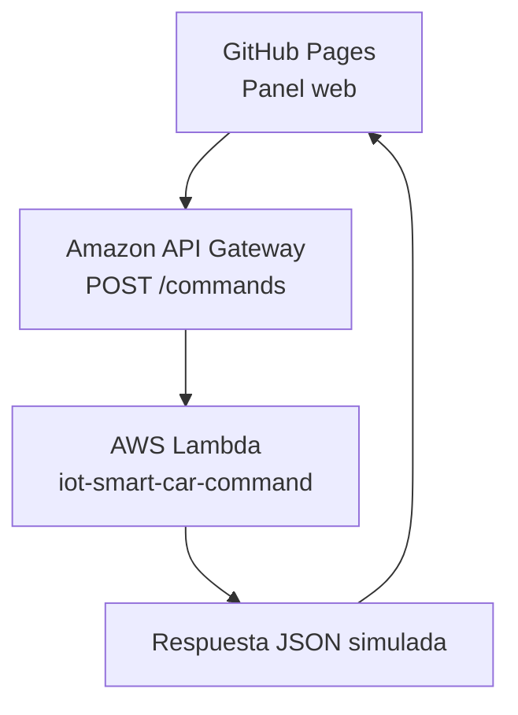

# Arquitectura del carrito IoT

## 1. Objetivo

El sistema permitirá controlar un carrito IoT desde una página web adaptable a celular y computadora.

La página se publicará mediante GitHub Pages. AWS se utilizará como intermediario entre el navegador y el módulo ESP32 instalado en el vehículo.

## 2. Arquitectura general planeada



## 3. Flujo de un comando

Ejemplo: el usuario mantiene presionado el botón **Adelante**.



## 4. Formato propuesto para comandos

```json
{
  "accion": "adelante",
  "velocidad": 60,
  "timestamp": 1780459200000
}
```

Acciones permitidas:

```text
adelante
atras
izquierda
derecha
detener
emergencia
```

## 5. Tópicos MQTT propuestos

```text
carrito/01/comandos
carrito/01/estado
carrito/01/telemetria
carrito/01/conexion
```

## 6. Telemetría propuesta

```json
{
  "online": true,
  "movimiento": "adelante",
  "velocidad": 60,
  "distancia_cm": 72,
  "timestamp": 1780459200500
}
```

## 7. Seguridad física

La seguridad del vehículo tendrá prioridad sobre la continuidad del movimiento.

El carrito deberá detenerse automáticamente cuando ocurra cualquiera de estas condiciones:

```text
El usuario suelta el botón
La pestaña pierde el foco
La conexión WiFi se interrumpe
AWS deja de responder
La ESP32 deja de recibir heartbeat
El usuario pulsa parada de emergencia
```

Mientras el usuario mantenga presionado un control, la página enviará periódicamente una señal de continuidad.

Si la ESP32 deja de recibir esa señal durante aproximadamente 750 milisegundos, detendrá los motores.

## 8. Seguridad lógica

La ESP32 utilizará:

```text
WiFi
MQTT
TLS
Certificados X.509
```

Los certificados, claves privadas y contraseñas no se almacenarán en GitHub.

La página web no tendrá acceso directo a los certificados privados del dispositivo.

## 9. Arquitectura actual implementada

La etapa actualmente implementada valida la comunicación entre la página web y AWS mediante API Gateway y Lambda.



Esta etapa permite comprobar:

```text
Diseño del dashboard
Controles táctiles
Control por teclado
Historial
Parada de emergencia
Visualización de telemetría
Vista secundaria
```

## 10. Hardware pendiente de validación

Cuando llegue el kit será necesario comprobar:

```text
Modelo exacto del módulo ESP32
Controlador de motores integrado en el shield
Asignación de pines
Comunicación entre ESP32 y Arduino UNO
Sensor ultrasónico
Servo
Cámara
Alimentación eléctrica
```